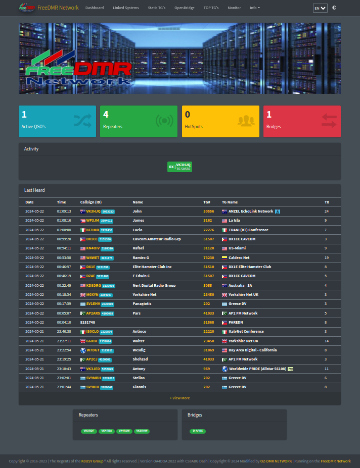

**Dashboard for FreeDMR Network Peer Servers**

***This version has been forked from FDMR Monitor by OA4DOA.***

## Changes to the Dashboard

*** 2024/05/22 ***
- Customise for FreeDMR Network
- Added Greek Language
    
**FDMR Monitor (Modifications & Customisation) by M0GLJ**

*** 2023/07/29 ***
- Added new flags.
- Introduced a new stanza called `DASHBOARD` in the configuration file(fdmr-mon.cfg).
- Users can now customize the dashboard settings using the `DASHBOARD` stanza.
- Display country flag before callsign in the lastheard table.
- Added power, latitude, longitude, and height in repeater/hotspot descriptions.
- Improved layout: Boxes and tables now hide when no repeaters, hotspots, or bridges are present.

*** 2023/70/23 ***
- The dashboard is now fully responsive and adapts to different screen sizes and devices.
- Users can now switch between dark and light mode for a more comfortable viewing experience.
- The dashboard now supports multiple languages, making it more accessible to users around the world.
- The main page of the dashboard now displays the number of active QSOs, connected repeaters, hotspots, and bridges.
- An new options calculator has been integrated into the dashboard for easy use.

## Flags:
***Flags have been introduced to add visual indicators for Talkgroups (TG) or DMR IDs. To enable flags for specific TGs or DMR IDs, follow these steps:***

- If you see the world flag flickering in the `lastheard`, `Linked systems`, etc. tables, you need to add or copy a new flag image in the `flags` folder.
- The flag image should be named with the first three digits of the Talkgroup or DMR ID.
- For example, if the Talkgroup is 12345678, place a file called `123.png` in the `flags` folder.

## Repeaters, Hotspots, and Bridges:
***The dashboard now distinguishes between Repeaters, Hotspots, and Bridges based on their DMR IDs and/or TX/RX frequency.***

- If a DMR ID has 6 digits, it is considered a Repeater and will be displayed in the `Repeaters` table.
- If a DMR ID has 7 digits or more and has a TX/RX frequency associated with it, it is recognized as a Hotspot and will be shown in the `Hotspots` table.
- If a DMR ID has 7 digits or more and has a TX/RX frequency of 0 (zero), it is identified as a Bridge and will appear in the `Bridges` table.

## Install Instructions

FDMR Monitor has been tested on Debian v10 and v11

This version of FDMR Monitor requires a web server like apache2, lighttpd and 
php 7.x running on the server.

    cd /opt
    sudo git clone https://github.com/m0glj/fdmr-monitor-freedmr-network.git
    cd FDMR-Monitor
    sudo chmod +x install.sh
    sudo ./install.sh
    sudo cp fdmr-mon_SAMPLE.cfg fdmr-mon.cfg
    - Edit fdmr-mon.cfg and adjust it to your server configuration:
      sudo nano fdmr-mon.cfg

    - Give readig permission to the config file:
      sudo chmod 644 fdmr-mon.cfg

    Copy the contents of the /opt/FDMR-Monitor/html directory to 
    the web server directory.
    - This example will work for Apache server:
      sudo cp /opt/FDMR-Monitor/html/* /var/www/html/ -r

    With this configuration your server will be available at:
      http://freedmr.network/

    Now you can configure the theme color and name for your Dashboard from the config.cfg file also
    you can define the height of the Server Activity 
    window: 45 1 row, 60 2 rows, 80 3 rows:
    HEIGHT_ACTIVITY = 45

    Now if you set TGCOUNT_INC to True the button will be added automatically
    If you want to modify or add any other button you will find a buttons.php file in the root of your
    web server.
    
    You can replace the logo with an image of your preference in the img/ directory img/logo.png
    
    - This will rotate the log file:
      sudo cp utils/logrotate/fdmr_mon /etc/logrotate.d/

    - Add the systemd file:
      sudo cp utils/systemd/fdmr_mon.service /lib/systemd/system/

    - Enable the monitor to start automatically after reboot:
      sudo systemctl enable fdmr_mon

    - You can start, stop, or restart with the next commands:
      sudo systemctl start fdmr_mon
      sudo systemctl stop fdmr_mon
      sudo systemctl restart fdmr_mon

    forward TCP port 9000 and web server port in firewall
        
    I recommend that you do not use the BRIDGE_INC = True option to display bridge information 
    (if you have multiple bridges displaying this information will increase the CPU load, 
    try to use BRIDGES_INC = False in config.py) 
    
    If for any reason you want to reset the database to the original values:
    sudo systemctl stop fdmr_mon
    sudo rm mon.db
    sudo python3 mon_db.py
    sudo systemctl start fdmr_mon

**FDMR Monitor by OA4DOA**

- FDMR Monitor for FreeDMR Servera based on HBMonv2 https://github.com/yuvelq/FDMR-Monitor 

**HBMonv2 by SP2ONG**

- HBMonitor v2 for DMR Server based on HBlink/FreeDMR https://github.com/sp2ong/HBMonv2 

**hbmonitor3 by KC1AWV**

- Python 3 implementation of N0MJS HBmonitor for HBlink https://github.com/kc1awv/hbmonitor3 

Copyright (C) 2013-2018  Cortney T. Buffington, N0MJS <n0mjs@me.com>

This program is free software; you can redistribute it and/or modify it under the terms of the GNU General Public License as published by the Free Software Foundation; either version 3 of 
the License, or (at your option) any later version.

This program is distributed in the hope that it will be useful, but WITHOUT ANY WARRANTY; without even the implied warranty of MERCHANTABILITY or FITNESS FOR A PARTICULAR PURPOSE. See the 
GNU General Public License for more details.

You should have received a copy of the GNU General Public License along with this program; if not, write to the Free Software Foundation, Inc., 51 Franklin Street, Fifth Floor, Boston, MA 
02110-1301  USA

---
